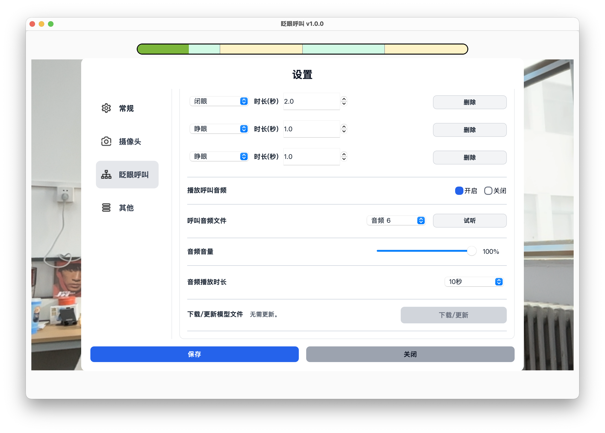

# 提醒声音设置

提醒声音设置用于决定触发呼叫后是否播放声音、播放哪一种铃声，以及声音持续多久。

## 开启或关闭呼叫声音

操作路径：

设置 -> 眨眼呼叫 -> 播放呼叫音频。

开启后，触发呼叫时软件会播放提醒声音，并显示呼叫提醒界面。

关闭后，触发呼叫时不会播放声音，也不会显示呼叫提醒界面。

如果软件用于日常呼叫，建议保持开启。

## 选择铃声

可以在【呼叫音频文件】中选择不同铃声。

## 试听铃声

点击【试听】按钮，可以在保存设置前听到当前铃声效果。

## 调整音量

可以调整软件内的呼叫音量。

这里调整的是软件音量，不会改变电脑系统音量。实际使用前，请确认电脑或蓝牙音箱本身的音量也合适。

## 设置播放时长

可以设置触发呼叫后声音播放多久。

如果希望提醒一直持续，直到家属手动停止，可以选择【无限长】。

