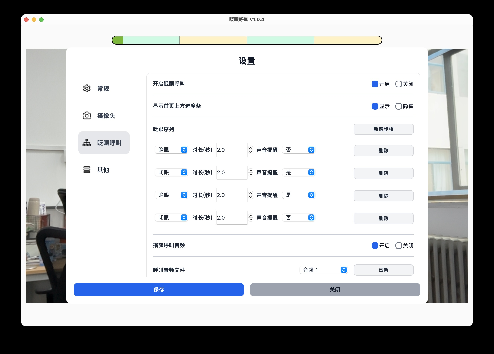

# 眨眼动作设置

眨眼动作设置决定患者需要按照怎样的顺序睁眼、闭眼，才能触发呼叫提醒。

完成首次测试前，建议先使用默认设置。需要调整时，每次只修改一项，并在保存后重新测试。

## 打开设置

进入：

**设置 → 眨眼呼叫**

确认“开启眨眼呼叫”为“开启”。建议同时保持“显示首页上方进度条”为“显示”，方便患者和照护者观察动作进度。

## 什么是眨眼序列

眨眼序列是一组连续的睁眼、闭眼动作。软件会按照设置顺序识别，全部完成后才触发呼叫。

当前默认序列为：

**睁眼 1.5 秒 → 闭眼 1 秒 → 睁眼 1 秒 → 闭眼 1.5 秒**

这套动作比自然眨眼持续时间更长，可以降低误触发的可能。

## 修改动作和持续时间

在“眨眼序列”中，每一行代表一个动作步骤：

- 动作可以选择“睁眼”或“闭眼”。
- 持续时间可以设置为 0.5 秒到 5 秒。
- “声音提醒”决定完成该步骤时是否播放短提示音。

修改完成后点击“保存”，回到主界面完成一次测试呼叫。

## 添加或删除步骤

- 点击“新增步骤”可以在序列末尾增加一个动作。
- 点击某一步右侧的“删除”可以移除该步骤。
- 序列至少需要保留一个步骤。

步骤越多，通常越不容易与自然眨眼混淆，但患者完成动作所需的时间和体力也会增加。

## 根据实际情况调整

| 遇到的情况 | 可以尝试 |
| --- | --- |
| 患者闭眼比较费力 | 适当缩短闭眼持续时间，但不要短到容易与自然眨眼混淆 |
| 经常没有主动呼叫却响铃 | 延长闭眼时间，或增加一到两个动作步骤 |
| 进度经常在中途清零 | 适当缩短难以保持的步骤，并确认 3 秒内开始下一步 |
| 整套动作太累 | 缩短持续时间或减少步骤 |
| 患者不知道何时进入下一步 | 为相应步骤开启“声音提醒” |

## 推荐的调整方法

1. 先记录或记住当前设置。
2. 每次只调整一个步骤或一个持续时间。
3. 点击“保存”并回到主界面。
4. 让患者在舒适状态下连续测试几次。
5. 同时观察是否容易完成、是否存在误触发。
6. 找到合适设置后，再用于日常呼叫。

!!! warning
    不要为了降低误触发而把动作设置得过长。患者能稳定、舒适地完成，比增加步骤更重要。

## 调整后无法正常使用

- 进度条不动或反复清零：查看[眨眼进度不动或反复重新开始](troubleshooting.md#blink-progress)。
- 经常误触发：查看[经常在无意中触发呼叫](troubleshooting.md#false-trigger)。
- 设置已经无法确认：使用“设置 → 其他 → 恢复默认设置”，然后重新测试。
