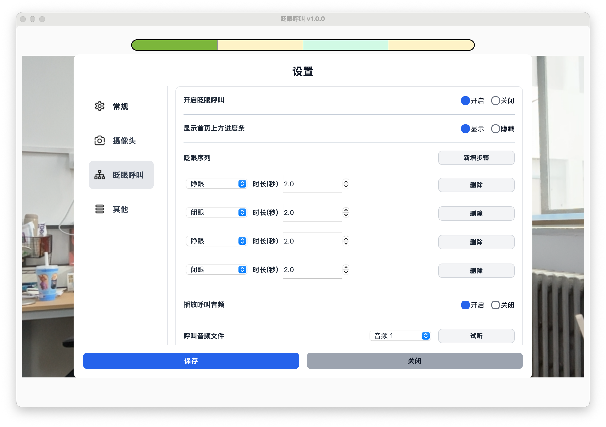
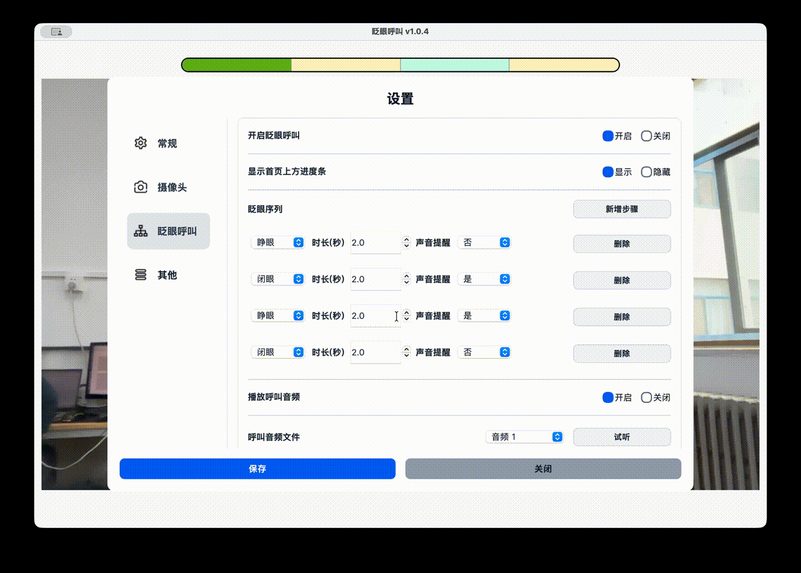

# 眨眼动作设置

眨眼动作设置用于决定病人需要完成怎样的睁眼、闭眼动作，才能触发呼叫提醒。

## 什么是眨眼序列

眨眼序列是一组连续的睁眼、闭眼动作。

软件会按照设置的顺序识别动作，全部完成后触发呼叫提醒。

## 默认眨眼序列

默认序列为：

睁眼 2 秒 -> 闭眼 2 秒 -> 睁眼 2 秒 -> 闭眼 2 秒。

这个序列比普通自然眨眼更长，可以减少误触发。

## 修改眨眼序列

操作路径：

设置 -> 眨眼呼叫 -> 眨眼序列。

可以修改每一步的动作类型和持续时间。

## 添加或删除动作步骤

点击【添加步骤】可以增加新的睁眼或闭眼动作。

如果序列中有多个步骤，可以删除不需要的步骤。

## 选择合适的持续时间

每一步可以设置为 0.5 秒到 5 秒。

建议先从默认设置开始测试，再根据病人的实际情况微调。

## 设置建议

- 如果病人闭眼比较费力，可以适当缩短闭眼时间。
- 如果没有主动呼叫时也容易响铃，可以增加动作步骤，或适当延长持续时间。
- 不建议设置得太长，避免病人完成时过于疲劳。
- 不建议只使用很短的闭眼动作，避免和自然眨眼混淆。
