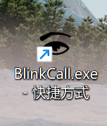
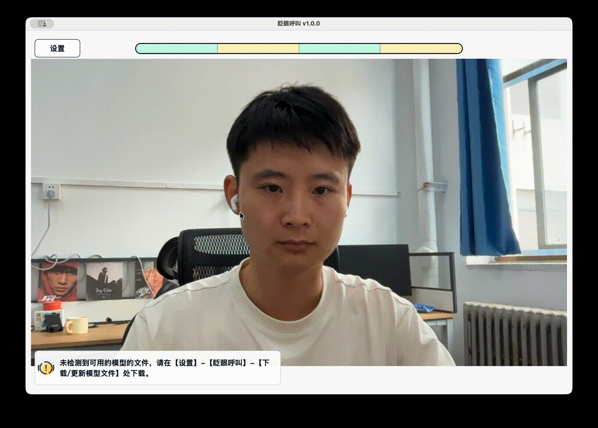
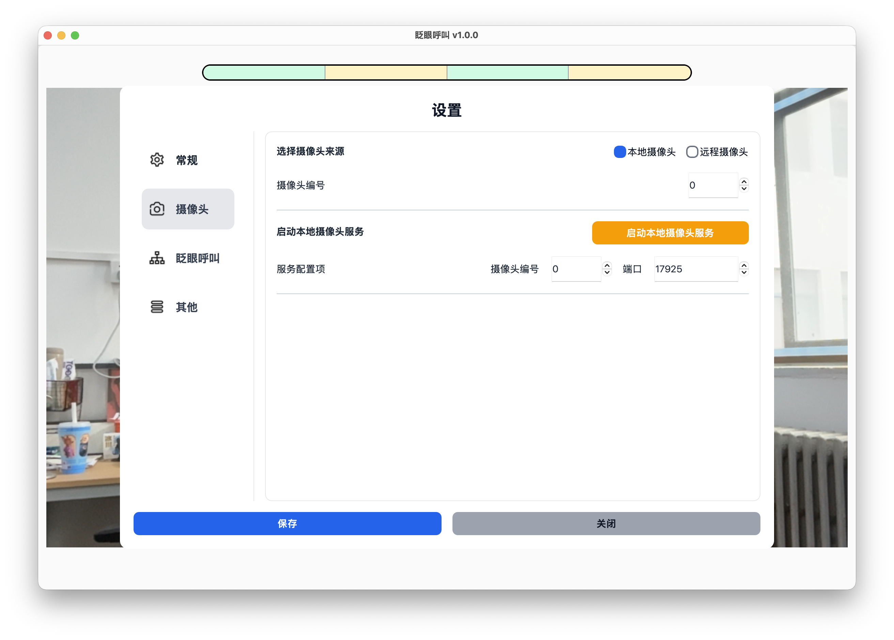
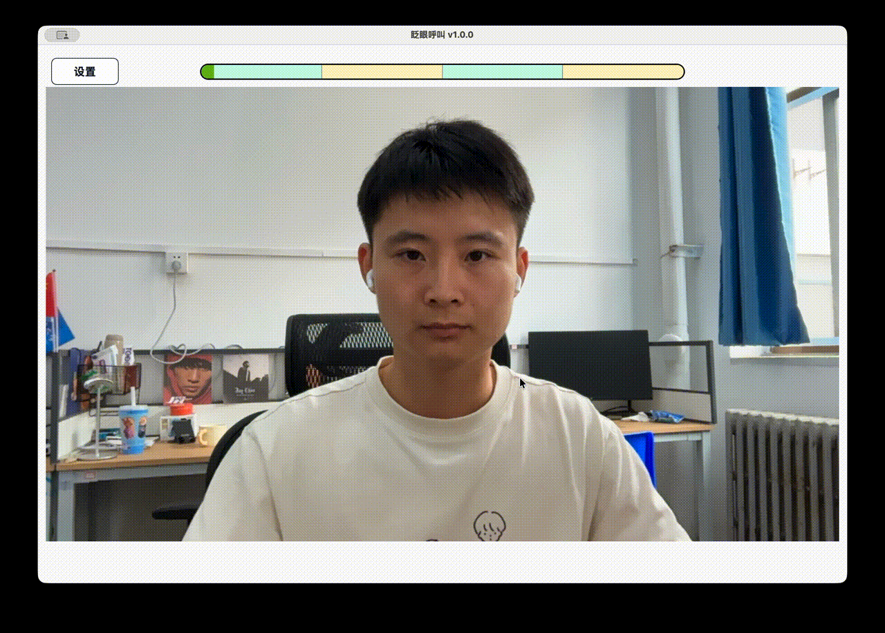

# 首次使用

本页适合第一次为病人配置软件的家属或照护者阅读。请按顺序完成以下步骤。

## 下载并解压软件

从下载地址获取最新版本的软件压缩包，并解压到一个固定位置。

建议不要直接在压缩包内运行软件，先完成解压后再打开。

## 打开软件

进入解压后的软件文件夹，双击 `BlinkCall.exe` 打开软件。

## 下载/更新模型文件

第一次使用时，必须先下载模型文件。

操作路径：

设置 -> 眨眼呼叫 -> 下载/更新模型文件。

点击【下载/更新】后等待下载完成。下载完成后，保存设置并返回主界面。

## 允许摄像头权限

如果系统弹出摄像头权限提示，请允许软件访问摄像头。

如果没有弹窗，可以直接继续下一步。

## 选择摄像头

默认情况下，软件会使用本地摄像头。

如果电脑连接了多个摄像头，可以在设置中调整摄像头编号。

## 调整病人与摄像头的位置

双眼需要完整出现在画面中，眼睛不要被遮挡。

## 完成一次测试呼叫

使用默认眨眼序列进行测试：

睁眼 2 秒 -> 闭眼 2 秒 -> 睁眼 2 秒 -> 闭眼 2 秒。

触发后，软件会播放提醒声音。确认声音正常后，可以点击停止按钮结束提醒。

