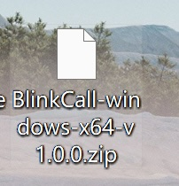
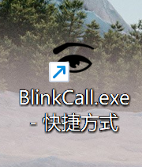
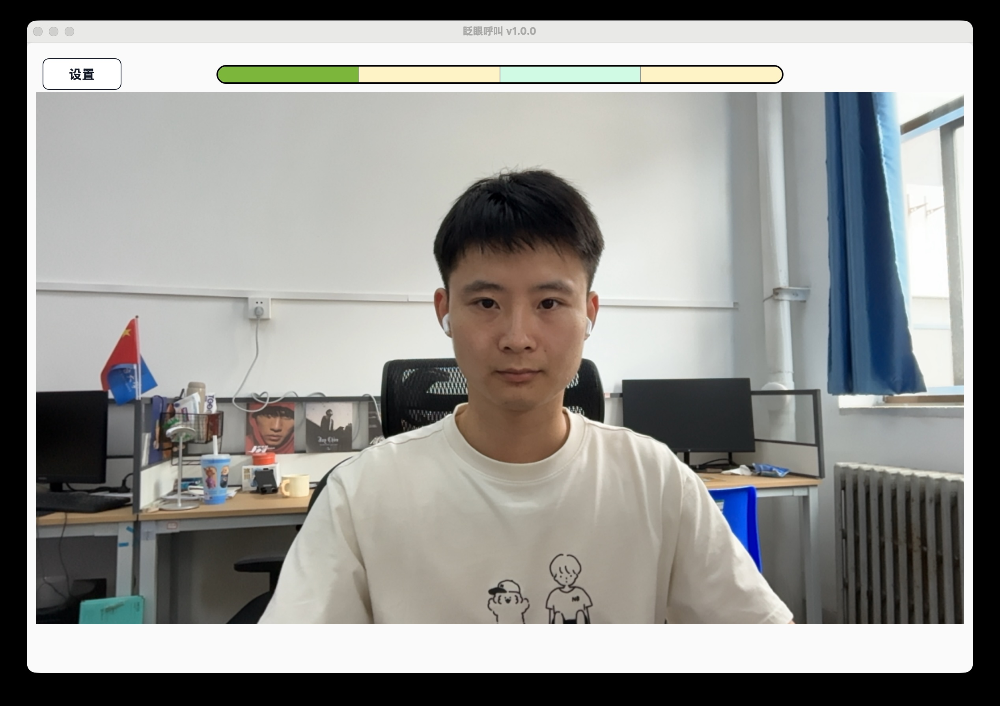
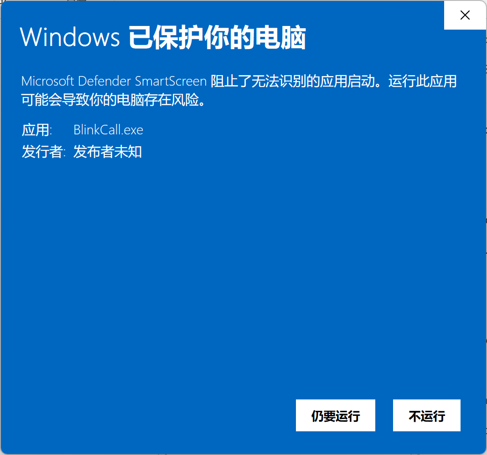
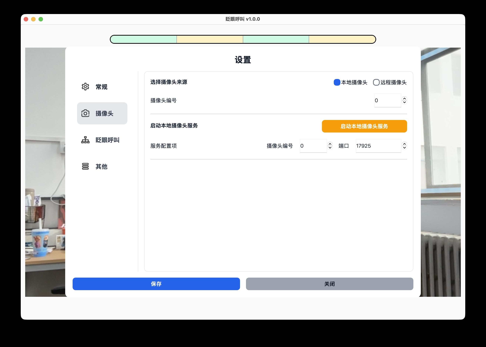

# 首次使用

本页适合第一次为患者配置软件的家属或照护者阅读。完成后，你应该能够看到稳定的摄像头画面，并成功触发一次有声音的测试呼叫。

## 1. 准备设备

开始前请准备：

- 一台 Windows 电脑。
- 电脑内置摄像头或 USB 摄像头。
- 电脑扬声器或蓝牙音箱。
- 可用的网络连接，用于首次下载模型文件。

建议让患者和照护者一起完成最后的测试。

## 2. 下载并解压软件

从下面任意一个地址下载最新的软件压缩包：

- [GitHub 最新版本](https://github.com/JouleEmbodiedAILab/blink-call/releases/latest)
- [百度网盘](https://pan.baidu.com/s/1Og8-TmnR_yIdsOA2_MHyiw?pwd=fk35)
- [夸克网盘](https://pan.quark.cn/s/e96254bb1153)

下载完成后：

1. 找到软件压缩包。
2. 将压缩包完整解压到一个固定位置。
3. 打开解压后的文件夹。

不要直接在压缩包内运行软件。

## 3. 打开软件

在解压后的文件夹中双击 `BlinkCall.exe`。

软件打开后，会进入主界面。模型文件和摄像头准备完成后，主界面会显示摄像头画面和顶部的眨眼进度条。

!!! tip "软件无法打开？"
    确认已经完整解压软件，并再次从解压后的文件夹中运行。如果仍然无法打开，请查看[软件无法打开](troubleshooting.md#app-wont-open)。

## 4. 下载模型文件

第一次使用时必须先下载模型文件。

1. 点击主界面左上角的“设置”。
2. 在左侧选择“眨眼呼叫”。
3. 找到“下载/更新模型文件”。
4. 点击“下载/更新”，等待进度完成。

!!! success "完成标志"
    下载成功后，下载进度窗口会关闭，设置会自动保存。返回主界面后，不再显示“未检测到模型文件”的提示。

!!! warning "下载没有成功"
    如果页面提示网络连接超时、网络连接失败或下载模型文件失败，请检查网络后重新尝试。详细步骤请查看[模型文件下载失败](troubleshooting.md#model-download-failed)。

## 5. 允许摄像头权限

如果 Windows 弹出摄像头权限提示，请选择允许。

如果没有弹窗，可以继续下一步。之后仍然看不到画面时，再到 Windows 的摄像头隐私设置中检查权限。

## 6. 选择摄像头

软件默认使用本地摄像头，摄像头编号为 `0`。

如果主界面没有画面：

1. 打开“设置 → 摄像头”。
2. 保持选择“本地摄像头”。
3. 将摄像头编号设为 `0`，点击“保存”并检查主界面。
4. 如果仍无画面，依次尝试 `1`、`2`、`3`，每次修改后都要保存。

!!! success "完成标志"
    主界面能够连续显示摄像头画面，而不是“摄像头不可用”或“正在尝试恢复”等文字提示。

连接多个摄像头或需要备用摄像头时，请查看[摄像头设置](camera.md)。

## 7. 调整患者和摄像头的位置

请调整摄像头或患者位置，直到：

- 患者面向摄像头，面部和双眼完整出现在画面中。
- 双眼没有被头发、被子、手或眼镜边框遮挡。
- 画面光线稳定，面部不过暗。
- 患者能够自然、舒适地保持当前位置。

如果主界面显示“未检测到人脸”“人脸关键点定位失败”或“关键点无效”，请查看[检测不到患者面部或双眼](troubleshooting.md#face-eyes-not-detected)。

## 8. 完成一次测试呼叫

当前默认眨眼序列为：

**睁眼 1.5 秒 → 闭眼 1 秒 → 睁眼 1 秒 → 闭眼 1.5 秒**

测试时：

1. 观察主界面顶部的进度条。
2. 按顺序保持睁眼或闭眼，直到当前阶段完成。
3. 完成一个阶段后，在 3 秒内开始下一个阶段。
4. 完成整个序列后，等待呼叫提醒界面出现并确认铃声响起。
5. 点击呼叫提醒界面，提前停止铃声。

!!! success "测试完成"
    同时满足以下条件，表示首次配置成功：

    - 摄像头画面连续、清楚。
    - 顶部进度条会跟随睁眼、闭眼动作前进。
    - 完成序列后出现呼叫提醒界面。
    - 电脑或蓝牙音箱能够听到铃声。
    - 点击呼叫提醒界面可以停止铃声。

如果进度不动、总是重新开始或没有声音，请进入[遇到问题](troubleshooting.md)。

## 下一步

- 日常使用前的检查方法：[日常使用](daily-use.md)
- 根据患者情况调整动作：[眨眼动作设置](blink-pattern.md)
- 调整铃声和音量：[提醒声音设置](audio-alert.md)
