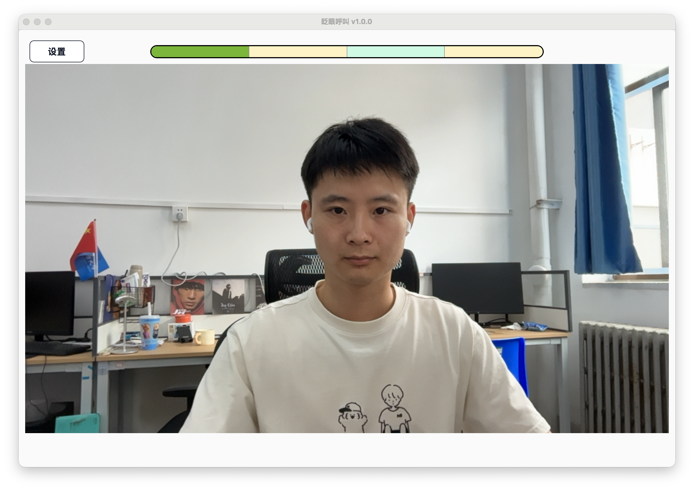
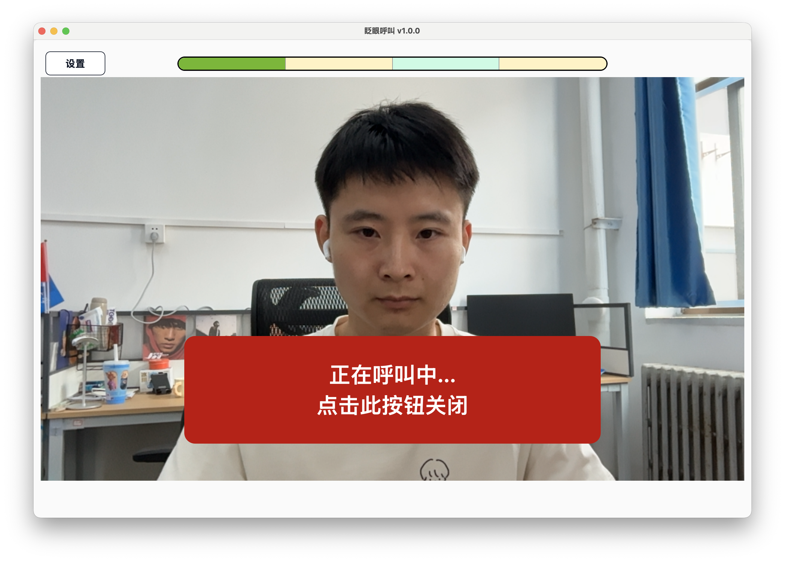

# 快速开始

本页用于帮助你快速完成一次测试呼叫。第一次使用时，请先确认软件已经下载并解压，电脑已连接摄像头和扬声器。

## 第 1 步：打开软件

打开解压后的软件文件夹，双击 `BlinkCall.exe`。

## 第 2 步：下载模型文件

点击左上角【设置】按钮，进入【眨眼呼叫】，在【下载/更新模型文件】处点击【下载/更新】。

等待模型文件下载完成后，保存设置并返回主界面。

## 第 3 步：确认摄像头能看清双眼

回到主界面后，确认画面中可以看到病人的双眼。双眼需要完整出现在画面中，眼睛不要被遮挡。

## 第 4 步：按默认眨眼序列测试呼叫

默认眨眼序列为：

睁眼 2 秒 -> 闭眼 2 秒 -> 睁眼 2 秒 -> 闭眼 2 秒。

请按顺序完成动作。动作过程中可以观察顶部进度条，进度条会显示当前完成情况。

## 第 5 步：停止呼叫提醒

触发呼叫后，软件会播放提醒声音，并显示呼叫提醒界面。

如果需要提前停止提醒，请点击呼叫提醒界面上的停止按钮。

